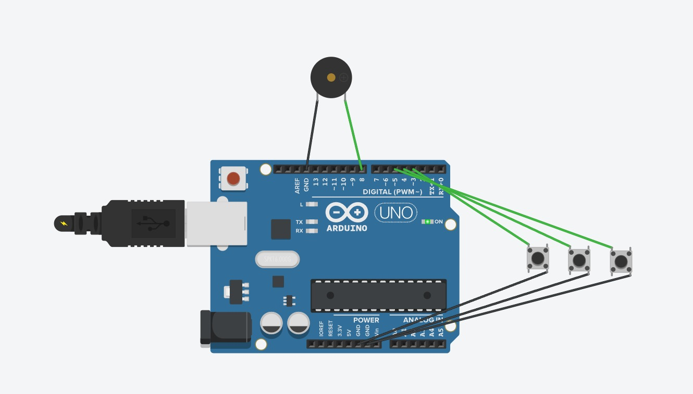

Essa imagem mostra um esquema de montagem usando uma placa Arduino Uno. O circuito consiste em:

Um buzzer conectado a um pino digital do Arduino.

Três botões momentâneos, conectados a pinos digitais diferentes, com seus terminais ligados ao GND e aos pinos digitais correspondentes.

Alimentação conectada ao Arduino via conector DC.

O diagrama ilustra o posicionamento dos componentes e as conexões elétricas necessárias para que o Arduino interaja com os botões e o buzzer.

